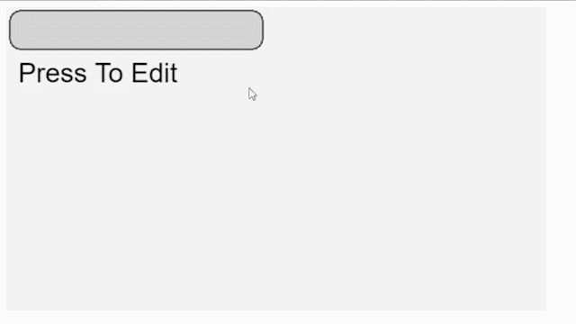

# PixiJS Input Field
Simple editable input fields / texts components for PIXI.js.

## Installation
- Build the **pixi-input-field.js**.
```shell
npm start
```
- Import **pixi.js** first, then import the **pixi-input-field.js**.
```html
<script src="https://cdnjs.cloudflare.com/ajax/libs/pixi.js/6.5.0/browser/pixi.min.js"></script>
<script src="./dist/pixi-input-field.js"></script>
```

## Usage
**1. Create TextInputField.**
```javascript
const font = new PIXI.TextStyle({
    fontSize: 32,
    fill: [
        "black"
    ],
});
const textInput = new PixiInputField.InputField("Press To Edit", font);
```

**2. Create TextInputField with background box.**
```javascript
const textInputBackground = new PIXI.Graphics();
textInputBackground.lineStyle(2, 0x4f4f4f, 1);
textInputBackground.beginFill(0x787878, 0.25);
textInputBackground.drawRoundedRect(4, 4, 300, 46, 16);
textInputBackground.endFill();
// Pass the background display object, will bind the interactive event on it.
const textInput = new PixiInputField.InputField("", font, textInputBackground);
textInput.x = 14;
textInput.y = 8;
```

**3. Get edited values.**
```javascript
let editedText = textInput.GetInputText();
console.log(editedText);
```
## Demo
