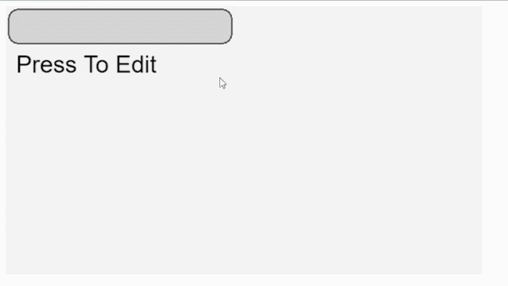

# PixiJS Input Field
Simple editable input fields / texts components for PIXI.js.

✨**Compatible with PixiJS v8**<br>
*(If you're using older version, please try v1.0)*

## Installation
### 🚩JavaScript + CDN
- Build the **pixi-input-field.js**.
```shell
npm start
```
- Import **pixi.js** first, then import the **pixi-input-field.js**.

```html
<script src="https://cdn.jsdelivr.net/npm/pixi.js@8.x/dist/pixi.min.js"></script>
<script src="./dist/pixi-input-field.js"></script>
```
### 🚩Typescript
- Copy **InputField.ts** into your project and import in your scripts.
```typescript
import { InputField } from './InputField';
const inputField = new InputField({text:"Press To Edit"});
```
## Usage
### 1. Create Input Fields.

- **Create TextInputField.**
    <br>(**⚠️It will lost control if text is empty.**)
    ```javascript
    const fontStyle = new PIXI.TextStyle({
        fontSize: 32,
        fill: "black",
    });
    const textInput = new PixiInputField.InputField({text:"", style:fontStyle, backgroundDisplay:textInputBackground});
    ```
    **You can setup the focus function in your own flow to get the control back.**
    ```javascript
    textInput.isEditing=true;
    const _text = textInput.text;
    textInput.text = _text.slice(0, textInput.preEditIndex) + textInput.editCursor + _text.slice(textInput.preEditIndex);
    textInput.inputElement.focus();
    ```
- **Create TextInputField with background box.**
    ```javascript
    const textInputBackground = new PIXI.Graphics();
    textInputBackground.lineStyle(2, 0x4f4f4f, 1);
    textInputBackground.beginFill(0x787878, 0.25);
    textInputBackground.drawRoundedRect(4, 4, 300, 46, 16);
    textInputBackground.endFill();

    const fontStyle = new PIXI.TextStyle({
        fontSize: 32,
        fill: "black",
    });
    const textInput = new PixiInputField.InputField({text:"", style:fontStyle, backgroundDisplay:textInputBackground});
    textInput.x = 14;
    textInput.y = 8;
    ```

### 2. Get edited values.
```javascript
let editedText = textInput.GetInputText();
console.log(editedText);
```
## Demo
